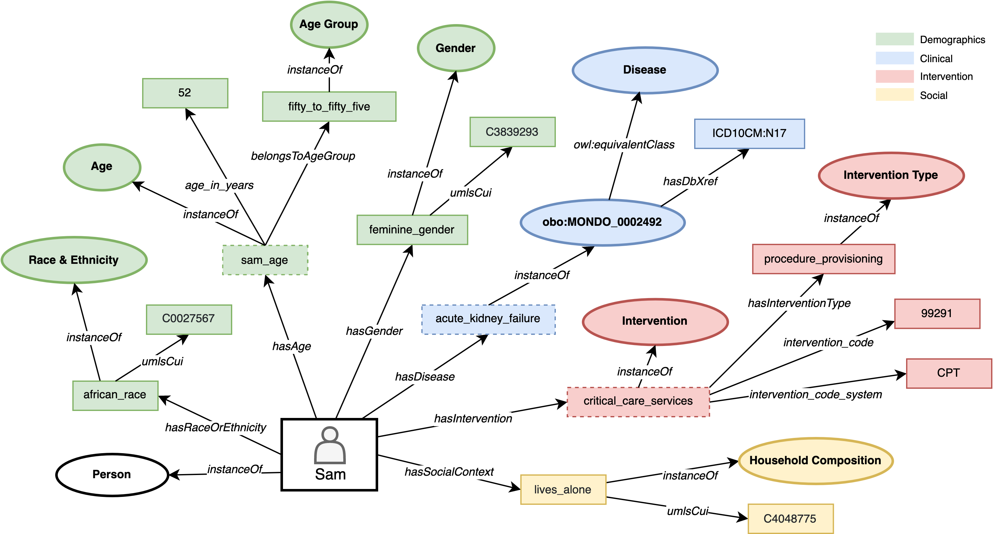

# Health & Social Person-centric Ontology  (HSPO)

[](ontology/hspo.ttl)
[](https://ibm.github.io/hspo-ontology/ontology-specification/)
[](https://ibm.github.io/hspo-ontology/ontology-specification/webvowl/index.html#)
[](LICENSE)
[](https://ibm.github.io/hspo-ontology/)

*Representing a 360-view of a person (or cohort) that spans across multiple domains, from health to social.*

The HSPO is an ontology that aims to represent and link together information about an individual from multiple domains. This work is motivated by the need to better understand the drivers of health outcomes that may arise from other domains including, but not limited to, the social determinants of health (e.g. ethnicity, transportation, education). This ontology can also describe a group of individuals that share similar characteristics (i.e. a cohort). Through this ontology we attempt to define a number of social contexts or social domains which can be useful to organise information coming from different terminologies such as ICD and SNOMED. 

The ontology can be used to generate person-centered or cohort-centered knowledge graphs (i.e. instances of the ontology) and support predictive analytics and other inference tasks in healthcare, life sciences, clinical research and social care use cases. For more uses and how-to's please see the [user guide](https://ibm.github.io/hspo-ontology/).

## Quick links

- [User Guide and Examples](https://ibm.github.io/hspo-ontology/)
- [Visualize with WebVOWL](https://ibm.github.io/hspo-ontology/ontology-specification/webvowl/index.html#)
- [Ontology Specification](https://ibm.github.io/hspo-ontology/ontology-specification/)
- [How to Contribute](CONTRIBUTING.md)
- [Github repository](https://github.com/IBM/hspo-ontology)

## Getting Started

The HSPO ontology can be used to create a knowledge graph (KG) of an individual person. Below is a fictitious example of a Person KG created from their electronic health records (EHRs). In this example, the person graph represents information about a patient's hospital episode after their were discharged. The patient is a 52 year-old female diagnosed with acute kidney failure. Demographic characteristics such as race, ethnicity and religion are included. Any medical interventions recorded during her hospital stay are also included in the graph, e.g. the use of critical care services. Social context factors recorded in her EHR indicate that she lives alone. Social context factors are important to consider particularly if they present barriers to follow-up treatment, for example, if the patient requires regular trips back to the hospital for dialysis. Bringing different facets together (e.g. clinical, social, behavioral) can allow physicians and care workers to better plan around the patient's needs in order to ensure better health outcomes (e.g. no further hospital readmissions). This example illustrates how, when available, information regarding the social context or social barriers for an individual can be brought together with their clinical information. Graphs can be created for all individuals attending critical care services and this ontology helps to query the information contained in those graphs (e.g. what are the social facets seen in patients attending these services or seen in specific ethnic groups). Further details about examples of how this representation is achieved and downstream KGs usage are included in the [user guide](https://ibm.github.io/hspo-ontology/).



Figure 1. Example of an individual patient knowledge graph derived from the HSPO ontology.

## Help and Support

Please feel free to reach out to one of the maintainers listed in the [MAINTAINERS.md](MAINTAINERS.md) page.

## Contributing 

We are always looking for help and support to continue to develop this project. Please see our [guidance](CONTRIBUTING.md) for details on how to contribute.

## Citing this Project

If you use the HSPO Ontology or code, please consider citing:

```bib
@software{HSPO,
author = {HSPO Team},
month = {9},
title = {{Health and Social Person-centric Ontology}},
url = {https://github.com/IBM/hspo-ontology},
version = {main},
year = {2022}
}
```

## License

The HSPO project is under the Apache 2.0 license. Please [see details here](LICENSE).
