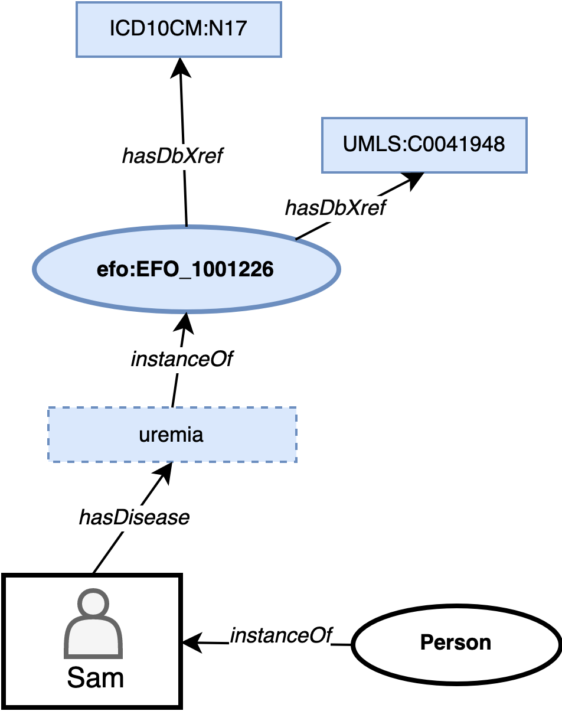

# Classes

:construction:  Documentation under construction.
 Please see the [Ontology Specification](ontology-specification/) for further technical details. 

The central point of a graph is a person (Class: Person) and has the following facets (ontology classes):

- [Disease](#disease)
- [Social Context](#social-context)
- [Behavior](#behavior)
- [Intervention](#intervention)
- [Demographics](#demographics) 
    - Age
    - Gender
    - Race & Ethnicity
    - Marital Status
    - Religion
    - Location
- [Evidence](#evidence)

HSPO classes will continue to be reviewed and extended in the future.

### Disease

HSPO uses the [Experimental Factor Ontology (EFO)](https://www.ebi.ac.uk/ols/ontologies/efo) for diagnosis definition. Diagnoses are defined by the Disease class.
The EFO ontology includes links to other terminologies and classification systems as exemplified in Figure 1.

Figure 1. Example of adding a disease to patient Sam.

### Social Context

The HSPO defines 11 different social context domains:

| Social Context      | Description |
| ----------- | ----------- |
| Built Environment      | The location surrounding an individual including neighborhood.       |
| Educational   | The educational attainment and literacy of an individual.        |
| Employment   | The labor context of an individual including unemployment.        |
| Financial   | The financial context of an individual including economic stability, material hardship and medical cost burden.        |
| Food Security   | The context in which an individual consumes or has access to food including nutritious or fresh foods and food poverty.        |
| Health and Welfare System   | The context and environment in which healthcare or social welfare are provided including access to services.        |
| Housing   | The physical environment context in which an individual finds shelter and/or resides.        |
| Judicial   | The judicial context of an individual including imprisonment, involvement in legal actions or jury duty.        |
| Political   | The political and government context of an individual including political affiliations and distrust in government institutions.        |
| Interpersonal, Social and Community Environment   | The social environment context of an individual including interpersonal relationships, community and culture.        |
| Transportation   | The context in which an individual requires to travel between locations including commuting.        |

The above social context domains were derived based on definitions of the social determinants of health from the following sources:

- [HL7 Gravity Project](https://confluence.hl7.org/display/GRAV/Terminology+Workstream+Dashboard)
- [WHO Social Determinants of Health](https://www.who.int/health-topics/social-determinants-of-health)
- [Healthy People 2030](https://health.gov/healthypeople/priority-areas/social-determinants-health)
- [ICD-11 Factors influencing health status or contact with health services](https://icd.who.int/browse11/l-m/en#/http%3a%2f%2fid.who.int%2ficd%2fentity%2f1249056269)
- [ICD-10 Z Codes](https://icd.who.int/browse10/2019/en#/XXI)

### Behavior

:construction: Work in progress.

### Intervention

HSPO defines the class intervention as a way to represent both social or clinical intervention including medical procedures, medication provision, social programs, etc. 

#### Intervention Types

The intervention types used in the HSPO ontology are defined by the [HL7 Gravity Project Interventions Framework](https://confluence.hl7.org/display/GRAV) which includes 8 different intervention types ([see example for Food Insecurity domain](https://confluence.hl7.org/display/GRAV/Food+Insecurity)).

### Demographics

The following demographics facets (classes) are included in this ontology:

  - Age
  - Gender
  - Race & Ethnicity
  - Marital Status
  - Religion
  - Location

### Evidence

:construction: Work in progress.
